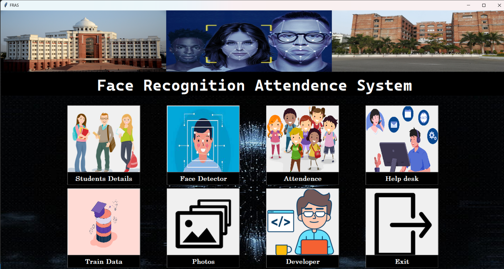
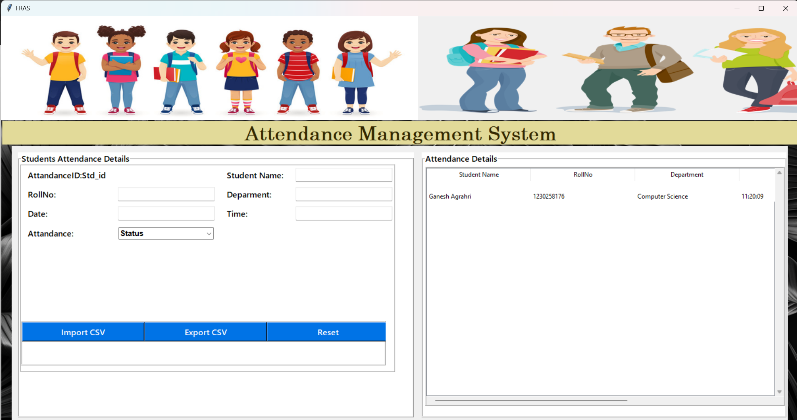
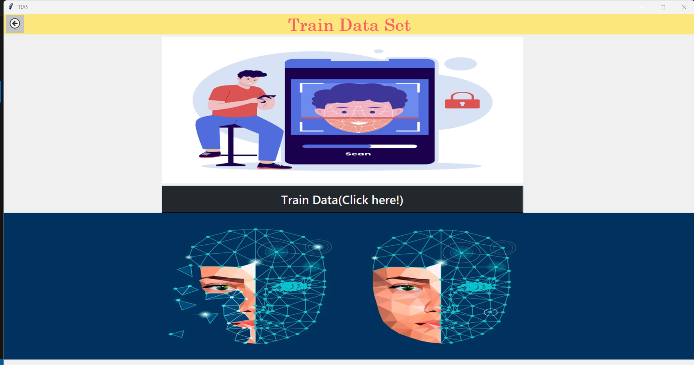
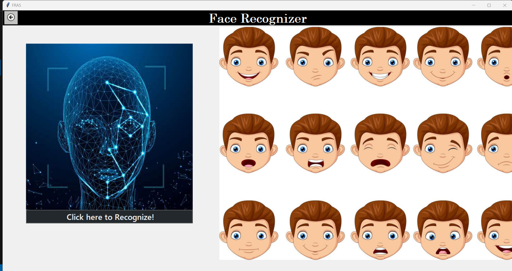
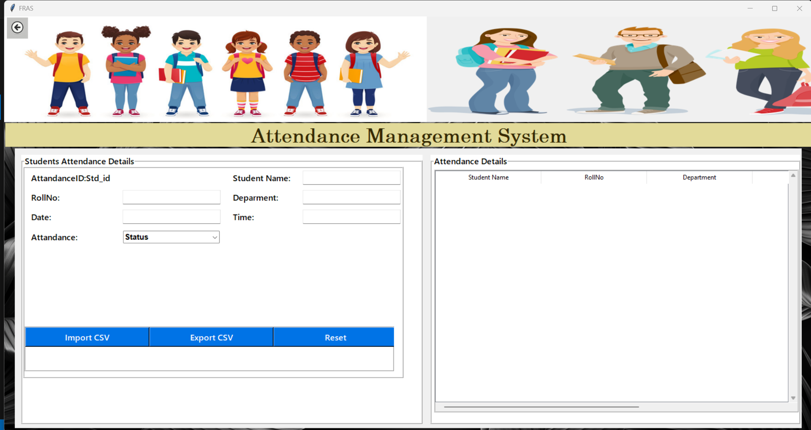

# 🎭 Face Recognition Attendance System

## 📌 Overview
The **Face Recognition Attendance System** is an automated attendance management solution that leverages face recognition technology to mark attendance efficiently. This project eliminates the need for manual attendance marking, reducing errors and improving efficiency.

## 🌟 Features
✅ **Face Registration:** Stores student details and face samples.
✅ **Training Module:** Trains the model using captured face samples.
✅ **Face Recognition:** Identifies registered faces in real time.
✅ **Automated Attendance Marking:** Logs attendance with timestamps.
✅ **CSV Export:** Saves attendance records for external use.

## 🛠 Tech Stack
- **💻 Programming Language:** Python
- **📚 Libraries Used:** OpenCV, NumPy, Pandas, Tkinter, SQLite
- **🗄 Database:** SQLite

## 🔄 Workflow
### 1️⃣ `main.py` - 🏠 Landing Page
   - Acts as the central hub of the application.
   - Provides access to all modules.
   
   

### 2️⃣ `student.py` - 📝 Student Registration
   - Stores student details in an SQLite database.
   - Captures and saves multiple face samples in a directory.
   
   

### 3️⃣ `train.py` - 🎯 Face Training
   - Trains the face recognition model using stored face samples.
   - Generates face embeddings linked to student IDs.
   
   

### 4️⃣ `face_recognize.py` - 📷 Face Recognition
   - Detects and recognizes registered faces in real time.
   - Displays the recognized face with the corresponding name and ID.
   
   

### 5️⃣ `attendance.py` - 📊 Attendance Marking
   - Marks attendance with name, ID, and timestamp.
   - Displays attendance records in real time.
   
   

### 6️⃣ `attendance.csv` - 📂 Exportable Attendance Data
   - Stores attendance records in CSV format.
   - Can be exported for further processing or sharing.
  

## 🚀 How to Use
1️⃣ **Run `main.py`** to launch the application.
2️⃣ **Register Students** using `student.py`.
3️⃣ **Train Faces** using `train.py`.
4️⃣ **Recognize Faces** using `face_recognize.py`.
5️⃣ **Mark Attendance** automatically using `attendance.py`.
6️⃣ **Export Attendance Data** from `attendance.csv`.

## 📥 Installation
```sh
pip install opencv-python numpy pandas tkinter sqlite3
```

## 🔮 Future Enhancements
- ☁️ Integration with cloud storage.
- 🎭 Improved accuracy using deep learning models.
- 🌍 Web-based version for remote access.

## 👨‍💻 Contributors
- **Ganesh Agrahari** - Developer

## 📜 License
This project is licensed under the MIT License.

